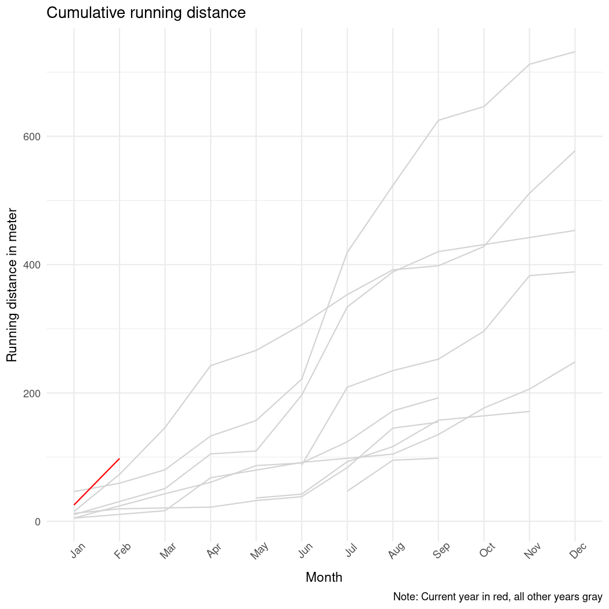

# Running Analysis

## Description
This repository holds an analysis of my running habits and development. The goal of this project is to motivate me with numbers that interest me. The data analyzed here was collected from my Garmin watches and hence it only includes runs that I logged on those. The analysis focuses only on runs and does not include bike rides, swims, and any brick workouts. 

## Content
1. The [01_data_preprocessing.R](./scripts/01_data_preprocessing.R) script, which prepares the downloaded Garmin data for analysis. The script is called with `source()` in all other scripts. 
2. The [02_data_visualization.R](./script/02_data_visualization.R) script, which produces a series of plots of quantities that I am interested in. Among those are over time developments of my average pace of my runs, running distance, and elevation gain. I am also interested in the relationship between heart rate, pace, and distance. Figures are stored in the [figures](./figures/) folder.
3. The [03_data_analysis.R](./script/03_data_analysis.R) script, which analyzes the data with statistical models

## Analysis

I was wondering how much I've been running over time and how my current running habits compare to those of previous years. The figure below is the cumulative running distance in each month. The gray lines are past years, the red line is 2021. This ought to motivate me to keep running and beat past years.  

Next, I was interested in my average 

