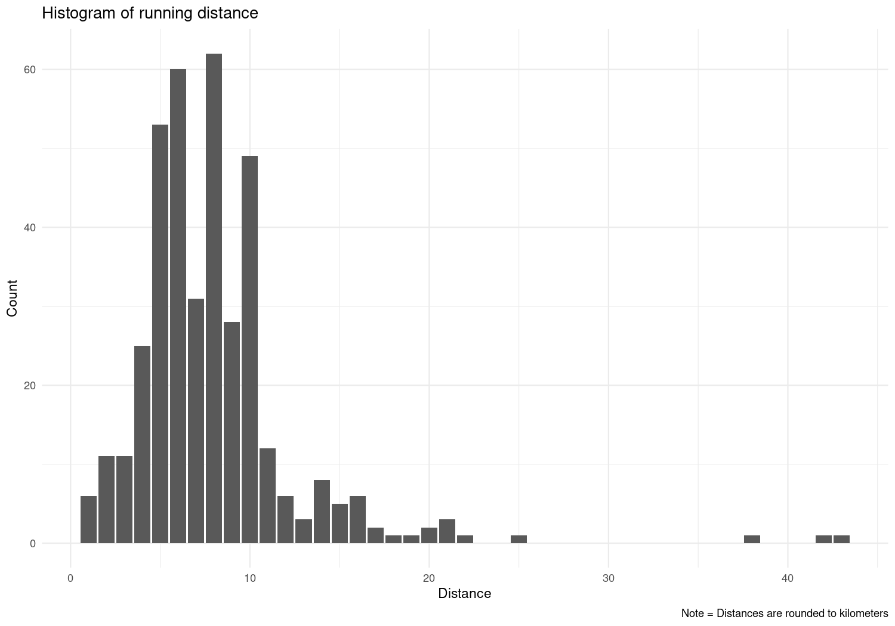

# Running Analysis

## Description
This repository holds an analysis of my running habits and development. The goal of this project is to motivate me with numbers that interest me. The data analyzed here was collected from my Garmin watches and hence it only includes runs that I logged on those. The analysis focuses only on runs and does not include bike rides, swims, and any brick workouts. 

## Content
1. The [01_data_preprocessing.R](./scripts/01_data_preprocessing.R) script, which prepares the downloaded Garmin data for analysis. The script is called with `source()` in all other scripts. 
2. The [02_data_visualization.R](./script/02_data_visualization.R) script, which produces a series of plots of quantities that I am interested in. Among those are over time developments of my average pace of my runs, running distance, and elevation gain. I am also interested in the relationship between heart rate, pace, and distance. Figures are stored in the [figures](./figures/) folder.
3. The [03_data_analysis.R](./script/03_data_analysis.R) script, which analyzes the data with statistical models

## Analysis

I was wondering how much I've been running over time and how my current running habits compare to those of previous years. The figure below is the cumulative running distance in each month. The gray lines are past years, the red line is 2021. This ought to motivate me to keep running and beat past years.  

A second metric that I am interested in is my average monthly pace. How fast are the runs that I am doing. The figure below shows my monthly average pace (lower is better) over time. The size and color of the dots indicate the number of runs (larger and ligher means more).

I am also interested in what type of distances I run. Most of my runs ar either part of a Garmin Training Plan or runs with friends. The distances have been rounded to full kilometers for better visualization. Apparently I have a lot of runs between 5k and 10k and then fewer runs between 10k and up to the marathon distance. 

Based on the separation in the frequency of distances in the histogram above I set out to examine the relationship between heart rate and running distance and pace and running distance. 

Looking first at heart rate: For runs up to 10km we have steep increase in my average heart rate. Going through entries in the data it becomes clear that the shorter runs in this subset are recovery runs and runs with friends and the runs closer to 10k are predominantly interval sessions and tempo runs from the Garmin Training Plan. That would explain the observed relationship pretty well. The relationship between average heart rate and running distance disappears for runs that are longer than 10km. Apparently, I'm able to find a rhythm in longer runs that I've no problems keeping up for some time. 

Now looking at average pace: Here we can see a similar story as in the previous figure. In the sub 10km section the shorter runs are the slower and more relaxed recovery runs, while the longer runs are the sessions with a lot of effort. For distances larger than 10km there is a decrease in my running pace over time. However, the 7:30 average pace marathon was the Austin Marathon that I completed with my wife. Removing this outlier flattens the line of best fit substantially and the relationship between distance and pace disappears. 

